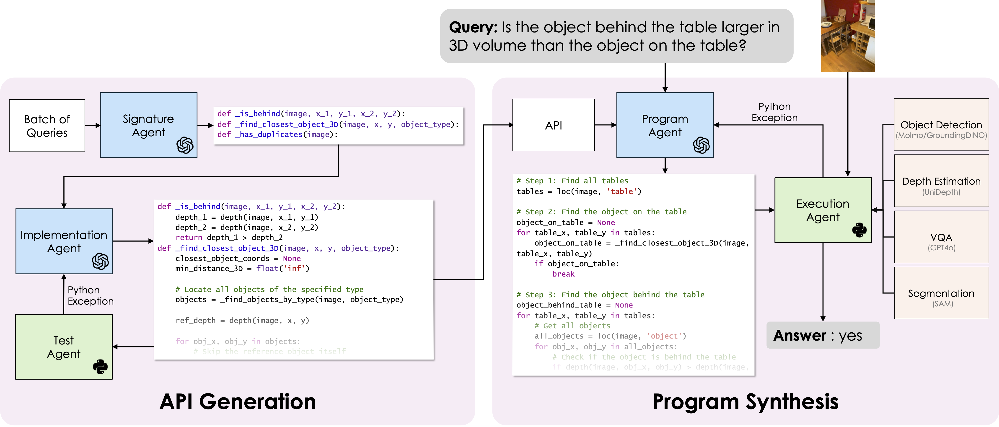

# VADAR: Visual Agentic AI for Spatial Reasoning with a Dynamic API

This is the code for the paper [Visual Agentic AI for Spatial Reasoning with a Dynamic API](https://glab-caltech.github.io/vadar/) by [Damiano Marsili](https://damianomarsili.github.io/), [Rohun Agrawal](https://rohunagrawal.github.io), [Yisong Yue](http://www.yisongyue.com/) and [Georgia Gkioxari](https://gkioxari.github.io/).

### [Project Page](https://glab-caltech.github.io/vadar/) | [Paper]() | [Dataset](https://huggingface.co/datasets/dmarsili/Omni3D-Bench) | [BibTeX](#Citation)



## Quickstart
Clone the repo:
```bash
git clone https://github.com/damianomarsili/VADAR.git
```
Setup environment and download models:
```bash
cd VADAR
python -m venv venv
source venv/bin/activate
sh setup.sh
echo YOUR_OPEN_API_KEY > api.key
```

Note: This setup assumes CUDA 12.2. If using a different version of CUDA, replace the `--index-url` in `setup.sh` with a CUDA runtime that is compatible with your CUDA version. For example, for CUDA 11.8, replace with `--index-url https://download.pytorch.org/whl/cu118`.

VADAR uses [SAM2](https://github.com/facebookresearch/sam2), [UniDepth](https://github.com/lpiccinelli-eth/UniDepth) and [GroundingDINO](https://github.com/IDEA-Research/GroundingDINO).

For a quick exploration of VADAR's functionality, we have compiled a notebook `demo-notebook/quickstart.ipynb`. For evaluating on larger datasets, please refer to the "Evaluating VADAR" section below.

## Omni3D-Bench
Omni3D-Bench contains 500 (image, question, answer) tuples of diverse real-world scenes sourced from [Omni3D](https://github.com/facebookresearch/omni3d). The dataset is released under the Creative Commons Non-Commercial license. View samples from the dataset [here](https://glab-caltech.github.io/vadar/omni3d-bench.html).


#### Downloading the Benchmark
Omni3D-Bench is hosted on [HuggingFace](https://huggingface.co/datasets/dmarsili/Omni3D-Bench). The benchmark can be accessed with the following code:

```
from datasets import load_dataset
dataset = load_dataset("dmarsili/Omni3D-Bench")
```

Additionally, a `.zip` of the dataset can be downloaded at the above link.

#### Annotations
Samples in Omni3D-Bench consist of images, questions, and ground-truth answers. The annotations can be loaded as a python dictonary with the following format:

```
<!-- annotations.json -->
{
    "questions": [
        {
            "image_index"               : str, image ID
            "question_index"            : str, question ID
            "image"                     : PIL Image, image for query
            "question"                  : str, query
            "answer_type"               : str, expected answer type - {int, float, str}
            "answer"                    : str|int|float, ground truth response to the query
        },
        {
            ...
        },
        ...
    ]
}
```

## Evaluating VADAR
Both Omni3D-Bench and the subset of CLEVR used in the paper can be downloaded with:
```bash
sh download_data.sh
```

You can use a custom dataset by placing it in the `data` directory. Your dataset folder should contain an `images` folder and an annotations.json in the format specified in the "Omni3D-Bench" section above.

To evaluate VADAR, run the following code:
```bash
python evaluate.py --annotations-json data/[DATASET_NAME]/annotations.json --image-pth data/[DATASET_NAME]/images/
```
Note: If evaluating VADAR on the CLEVR or GQA datasets, add the additional `--dataset clevr OR gqa` tag. If omitted, the prompts and API for Omni3D-Bench will be used.

The evaluation script will produce the following files:

```
results/[timestamp]/
├── signature_generator # signatures generated by Signature Agent
│   ├── image_1_question_2.html        
│   ├── image_5_question_8.html 
│   ├── image_9_question_14.html 
│   └── ...
├── api_generator # method implementations generated by API Agent
│   ├── method_1
│   │   ├── executable_program.py   # python implementation of method
│   │   └── result.json             # Unit test result
│   ├── method_2
│   │   ├── executable_program.py   # python implementation of method
│   │   └── result.json             # Unit test result
│   ├── ...    
│   └── api.json                    # JSON of generated API.
├── program_generator # programs generated by Program Agent
│   ├── image_0_question_0.html        
│   ├── image_0_question_1.html 
│   ├── image_1_question_2.html 
│   ├── ...
│   └── programs.json               # JSON of generated programs.
├── program_execution # execution log of programs. (TODO: dami here)
│   ├── image_0_questions_0
│   │   ├── executable_program.py   # python implementation of query solution
│   │   ├── result.json             # JSON of program output
│   │   └── trace.html              # Visualization of output trace.
│   ├── image_0_questions_1
│   │   ├── executable_program.py   # python implementation of query solution
│   │   ├── result.json             # JSON of program output
│   │   └── trace.html              # Visualization of output trace.
│   ├── ...    
│   └── execution.json              # JSON of experiment execution
├── execution.csv                   # CSV with full execution log.
└── results.txt                     # Summarized Results
```
## Results
See [`RESULTS.md`](RESULTS.md) for detailed VADAR performance on Omni3D-Bench, CLEVR, and GQA, as well as comparison with other methods.

## Citation
If you use VADAR or the Omni3D-Bench dataset in your research, please use the following BibTeX entry.

```bibtex

```


